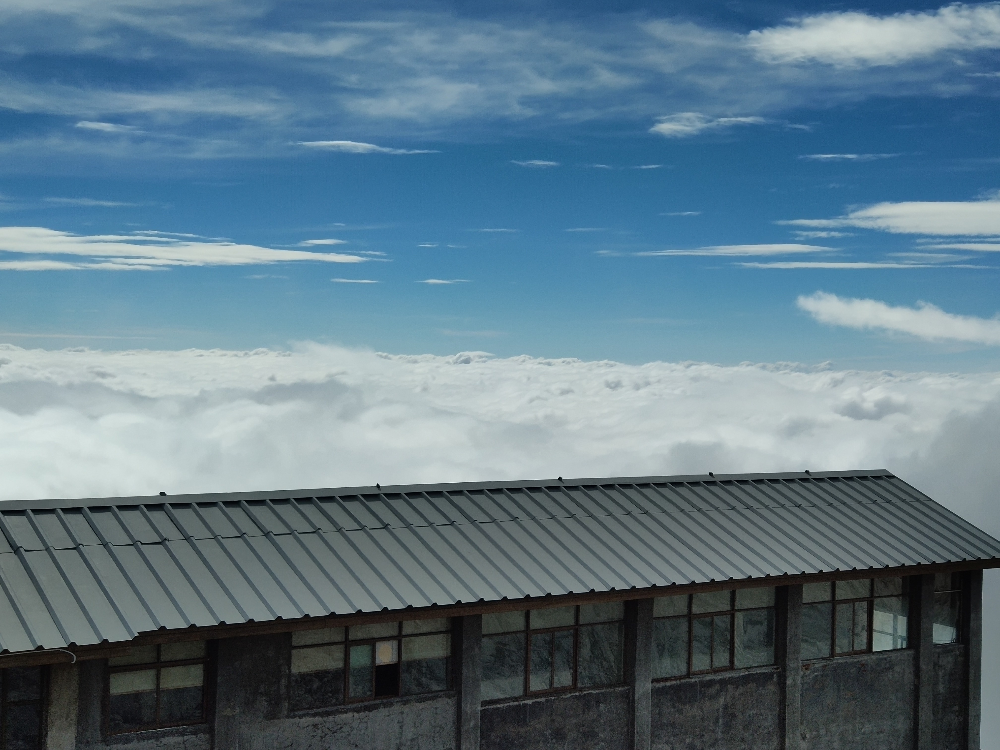

## A H2 header
#### H4 header

[cppAPI](https://www.cplusplus.com/reference/cstdlib/rand/)

[another markdown file](./another.md)

___

##### a picture from the directory



##### a picture from the internet


```c++
int main() {
  std::cout << "Hello world!" << std::endl;
  return 0;
}
```

> Standing on the shoulders of Giants

1. numbered list
2. a table

* code block
* quote


| number | content |
| ------ | ------- |
| First  | Table   |
| Second  | Italic text |


**a bold text** 

*italic text* 

---
___

~~strikethrough text~~

